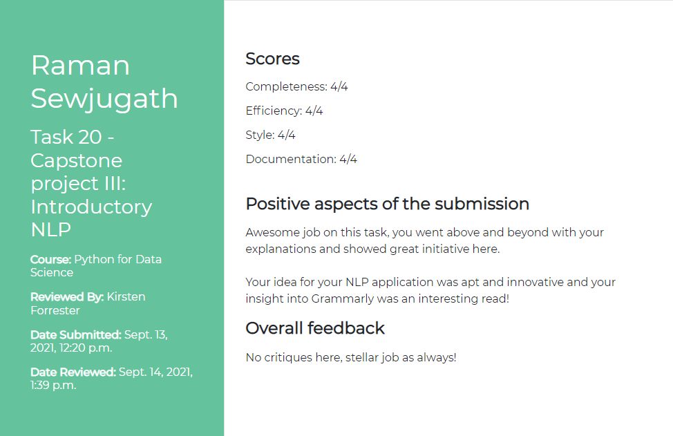

# Capstone Project 1.3 - Introductory NLP
One of the Natural Language Processing projects I had to do

### Introduction to NLP
A written piece on how Natural Language Processing is used in [Grammarly](https://grammarly.com)

### NLP Movie Suggestion
This program reads in the decription of the movie a user has watched and gets a similarity score of a list of movies based on their descriptions, thus suggesting the top 3 movies a user should watch next

## Code Review

